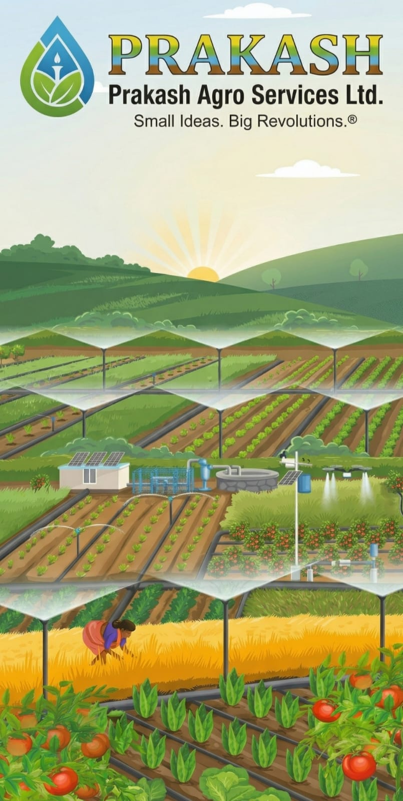
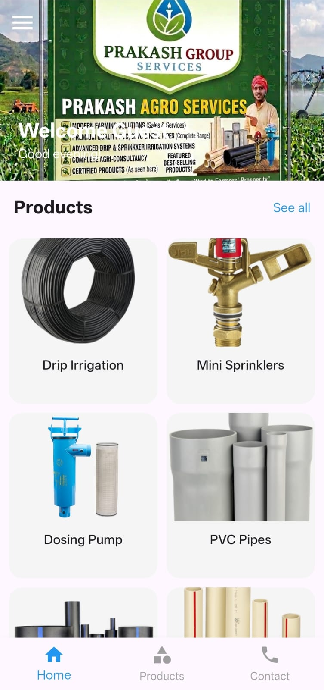

# 🌱 Prakash Agro App

> A modern Flutter-based mobile application designed to simplify agricultural services and provide a smooth user experience.

---

## 🚀 Badges


## 📱 Project Overview

**Prakash Agro App** is an Android application built using Flutter that helps users interact with agricultural services efficiently. The app focuses on simplicity, performance, and real-world usability.

It includes authentication, a clean dashboard, and a scalable structure for future enhancements like e-commerce and order tracking.

---

## ✨ Features

* 🔐 OTP-based Phone Authentication (Firebase)
* 📲 Clean and user-friendly UI
* 🏠 Dashboard screen for navigation
* 🌍 Country code picker support
* ⚡ Fast and responsive performance
* 🔥 Firebase backend integration

---

## 🛠️ Tech Stack

| Technology    | Description               |
| ------------- | ------------------------- |
| Flutter       | Cross-platform UI toolkit |
| Dart          | Programming language      |
| Firebase Auth | Phone OTP authentication  |
| Material UI   | UI components             |

---

## 📸 Screenshots

### Preview

<p align="center">
  <b>Interface</b><br>
  <br><br>

  <b>Login Screen</b><br>
  <br><br>

  <b>Dashboard</b><br>
  
</p>

### View in Full Size

🔗 [Interface](screenshots/interface.jpeg)  
🔗 [Login](screenshots/login.jpeg)  
🔗 [Dashboard](screenshots/dashboard.jpeg)

---

## ⚙️ Installation & Setup

1. Clone the repository:

```bash
git clone https://github.com/prajwalchaudhari60/prakash_agro_app.git
```

2. Navigate to project folder:

```bash
cd prakash_agro_app
```

3. Install dependencies:

```bash
flutter pub get
```

4. Run the app:

```bash
flutter run
```

---

## 📂 Project Structure

```
lib/
 ┣ screens/
 ┣ widgets/
 ┣ services/
 ┗ main.dart
```

---

## 🎯 Future Enhancements

* 🛒 Add product purchase feature
* 📦 Order tracking system
* 📊 Admin panel
* 🌐 Multi-language support

---

## 🤝 Contributing

Contributions are welcome! Feel free to fork this repository and submit a pull request.

---

## 📧 Contact

* GitHub: [https://github.com/prajwalchaudhari60](https://github.com/prajwalchaudhari60)

---

## ⭐ Show Your Support

If you like this project, give it a ⭐ on GitHub!

---

> Built with ❤️ using Flutter
